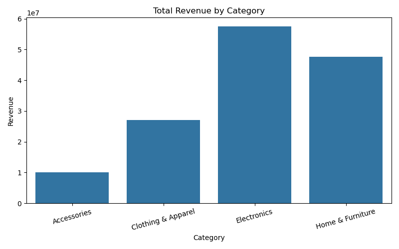
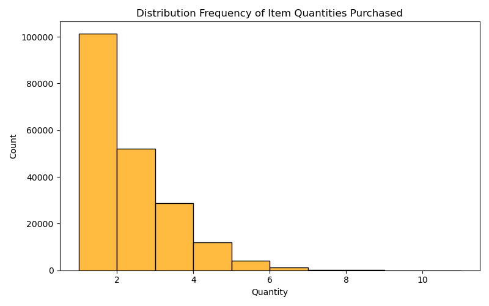
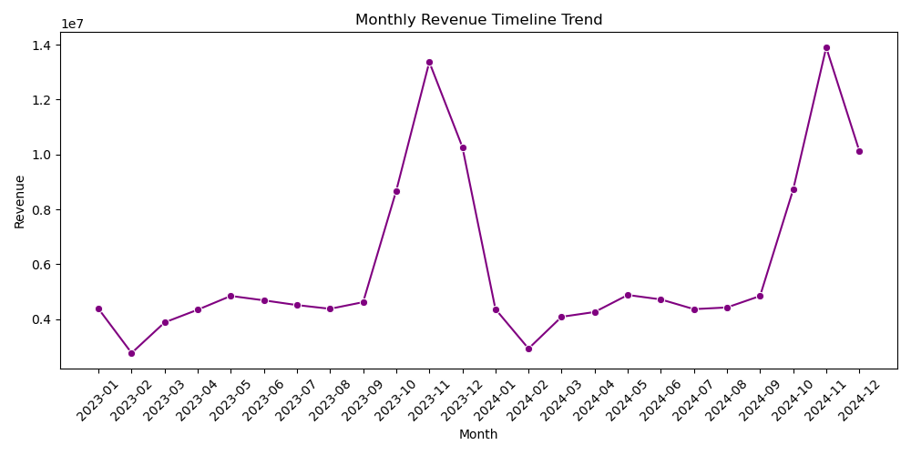
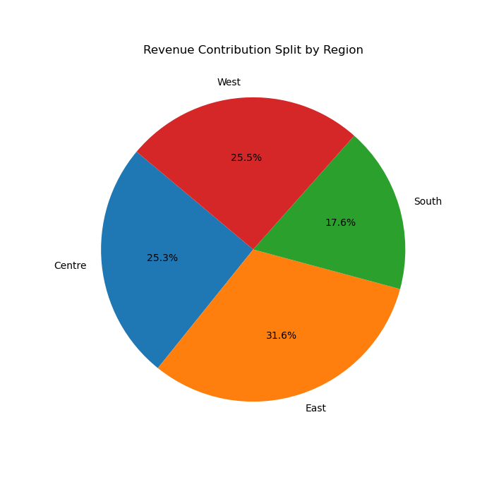
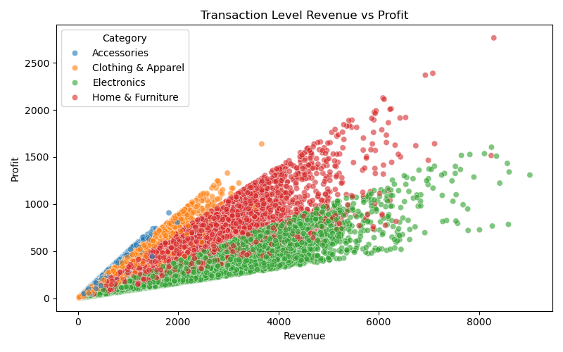
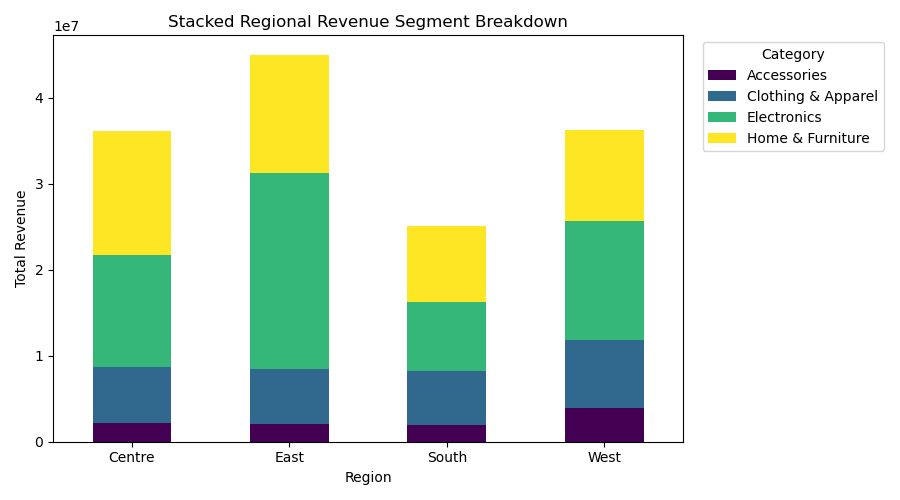

# 📊 Sales Data Analyzer

A comprehensive, menu-driven Python CLI application for **loading, exploring, cleaning, analyzing, and visualizing** large-scale sales transaction data using **Pandas**, **NumPy**, **Matplotlib**, and **Seaborn**.

The tool works with a rich sales dataset (200,000+ rows) containing order details, customer information, product categories, revenue, and profit metrics.

---

## ✨ Features

- 📂 **Load Dataset** — Automatically detect and load `sales_data.csv` with cleaned column names
- 🔍 **Explore Dataset** — View shape, head/tail, column names, data types, and full DataFrame info
- 🧹 **Prepare Dataset** — Convert dates, handle missing values, create Month / Year / Day helper columns
- ⚙️ **DataFrame Operations**
  - Add Day-of-week and Month columns
  - Find State & City with highest average revenue
  - Identify Category / Sub-Category with max & min average profit
  - Compute correlation matrix of numeric columns
- 📈 **Descriptive Statistics** — Summary statistics for all numeric features
- 🎨 **Interactive Visualizations**
  - Bar Chart — Total Revenue by Category
  - Line Chart — Monthly Revenue Timeline Trend
  - Scatter Chart — Transaction-level Revenue vs Profit (by Category)
  - Pie Chart — Revenue Contribution by Region
  - Histogram — Distribution of Item Quantities Purchased
  - Stacked Bar Chart — Regional Revenue breakdown by Category
- 💾 **Save All Charts** — Export every visualization as high-quality PNG files in one click

---

## 🛠️ Tech Stack

- **Python 3**
- **Pandas** — Data loading, cleaning, aggregation, and feature engineering
- **NumPy** — Numerical operations and correlation
- **Matplotlib** + **Seaborn** — Publication-quality charts
- Menu-driven CLI with nested sub-menus and robust input validation

---

## 🧠 Skills Demonstrated

| Concept                        | Implementation                                      |
|--------------------------------|-----------------------------------------------------|
| **Data Loading & Cleaning**    | CSV ingestion, column stripping, datetime parsing, missing-value handling |
| **Exploratory Data Analysis**  | Shape, head/tail, dtypes, info, descriptive stats   |
| **Feature Engineering**        | Month, Year, Day-of-week extraction from Order_Date |
| **GroupBy & Aggregation**      | Revenue/Profit analysis by State, City, Category, Region |
| **Correlation Analysis**       | Numeric feature relationships                       |
| **Data Visualization**         | 6 different chart types with proper titles & styling |
| **Menu-Driven Architecture**   | Nested interactive menus with clean error handling  |
| **Object-Oriented Design**     | Encapsulated `SalesDataAnalyzer` class              |

---

## 📊 Workflow

```mermaid
flowchart TD
    A([Start]) --> B[Main Menu]
    
    B --> C[1. Load Dataset]
    B --> D[2. Explore Dataset]
    B --> E[3. Preparing Dataset]
    B --> F[4. DataFrame Operations]
    B --> G[5. Generate Descriptive Statistics]
    B --> H[6. Visualization]
    B --> I[7. Save Visualization]
    B --> J[8. Exit]

    D --> D1[Shape]
    D --> D2[Head / Tail]
    D --> D3[Columns / Dtypes / Info]
    D --> B

    E --> E1[Datetime conversion]
    E --> E2[Missing value handling]
    E --> E3[Month / Year / Day columns]
    E --> B

    F --> F1[Add Day & Month]
    F --> F2[Top State-City by Revenue]
    F --> F3[Max/Min Profit Categories]
    F --> F4[Correlation Matrix]
    F --> B

    H --> H1[Bar Chart]
    H --> H2[Line Chart]
    H --> H3[Scatter Chart]
    H --> H4[Pie Chart]
    H --> H5[Histogram]
    H --> H6[Stacked Chart]
    H --> B

    I --> I1[Save all 6 charts as PNG]
    I --> B

    J --> K([Thank You - End])
```



---

## 📸 Screenshots

### 1️⃣ Main Menu & Dataset Loading


### 2️⃣ Explore — Shape, Head & Tail


### 3️⃣ Explore — Columns, Dtypes & Info


### 4️⃣ Data Preparation


### 5️⃣ DataFrame Operations — Day/Month & Top City


### 6️⃣ Max/Min Profit Categories & Correlation


### 7️⃣ Descriptive Statistics


### 8️⃣ Visualization Menu


### 9️⃣ Running Multiple Charts


### 🔟 Exit


---

## 📈 Generated Visualizations

| Chart | Description |
|-------|-------------|
| **Bar Chart** | Total Revenue by Category |
| **Line Chart** | Monthly Revenue Timeline Trend (2023–2024) |
| **Scatter Chart** | Transaction-level Revenue vs Profit colored by Category |
| **Pie Chart** | Revenue Contribution Split by Region |
| **Histogram** | Distribution Frequency of Item Quantities Purchased |
| **Stacked Bar** | Regional Revenue Segment Breakdown by Category |








---

## 📁 Project Structure

```text
.
├── Visualizer.py              # Main application (SalesDataAnalyzer class + CLI)
├── sales_data.csv             # Large sales transaction dataset (~200k rows)
├── README.md
├── bar_chart.png
├── histogram.png
├── line_char.png
├── pie_chart.png
├── scatter_chart.png
├── stack_chart.png
└── Screenshots/
    ├── Screenshot-1.png
    ├── Screenshot-2.png
    ├── ...
    └── Screenshot-10.png
```

---

## ▶️ How to Run

```bash
python Visualizer.py
```

> **Requirements:**  
> - Python 3.8+  
> - `pandas`, `numpy`, `matplotlib`, `seaborn`

Install dependencies if needed:

```bash
pip install pandas numpy matplotlib seaborn
```

Place `sales_data.csv` in the same directory (or in `/home/workdir/attachments/`). The application will automatically locate it.

---

## 📋 Dataset Overview

| Column          | Description                          |
|-----------------|--------------------------------------|
| Order_ID        | Unique order identifier              |
| Order_Date      | Date of the order (MM-DD-YY)         |
| Customer_Name   | Name of the customer                 |
| City / State    | Location details                     |
| Region          | Centre / East / South / West         |
| Country         | United States                        |
| Category        | Accessories, Clothing & Apparel, Electronics, Home & Furniture |
| Sub_Category    | More granular product grouping       |
| Product_Name    | Specific product                     |
| Quantity        | Number of items purchased            |
| Unit_Price      | Price per unit                       |
| Revenue         | Total revenue for the line item      |
| Profit          | Profit generated                     |

**Size:** 200,000 rows × 14 columns  
**Date Range:** 2023-01-01 → 2024-12-31

---

## 💼 Why Recruiters Should Care

This project demonstrates real-world data analysis skills that map directly to business intelligence and data science roles:

- ✅ End-to-end **data pipeline** (load → clean → explore → analyze → visualize)
- ✅ Proper use of **Pandas** for large datasets (200k+ rows)
- ✅ Clean **object-oriented design** with a reusable analyzer class
- ✅ Multiple **visualization types** with professional styling
- ✅ Nested **menu-driven CLI** with solid error handling
- ✅ Practical business insights (top cities, profitable categories, regional performance, seasonal trends)

Ideal for showcasing applied data analysis and visualization skills in Python.

---

⭐ If you found this project useful, consider giving it a star!

## 👨‍💻 Author

**Akshar Tailor**
